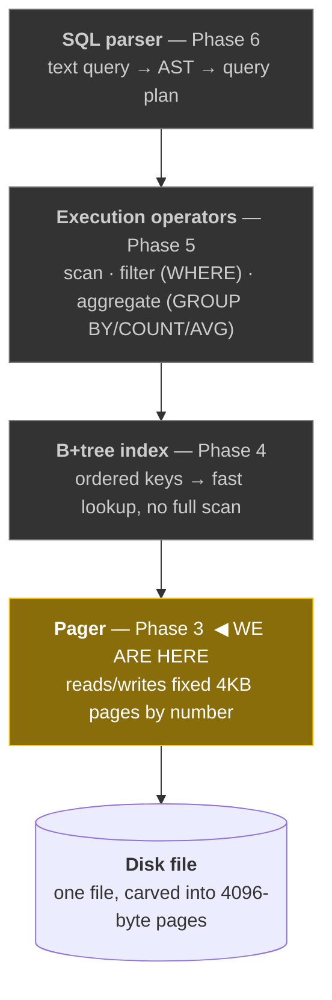
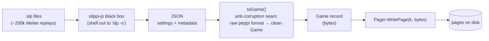
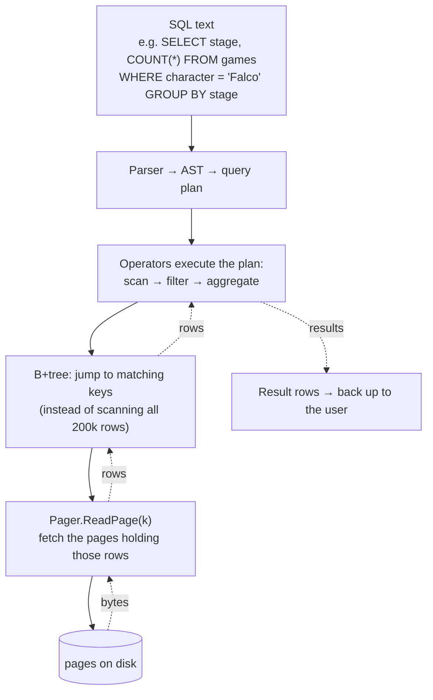
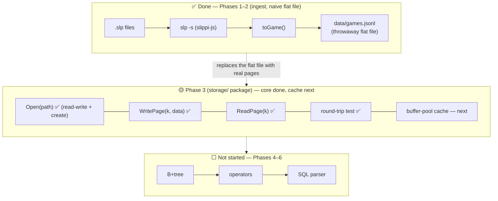

# rslp — Architecture

> Visual companion to `CONTEXT.md` (mission) and `PROGRESS.md` (roadmap & status).
> Diagrams use [Mermaid](https://mermaid.js.org/), which GitHub renders natively.
>
> **Two things are drawn here:**
> 1. **The engine stack** — the final layered design, built bottom-up.
> 2. **The two data paths** — how data flows *in* (ingest) and how a query flows *down* and back *up*.
> 3. **Where we are today** — the slice of the above that actually runs right now.

---

## 1. The engine stack (final design, built bottom-up)

A database is a stack of layers. Each layer only talks to the one directly below it, and
hides its complexity from the one above. We build **from the bottom up** — you can't have a
table until pages, a B+tree, and records exist beneath it.

**Why bottom-up:** the pager knows nothing about games or tables — it just moves bytes in
fixed blocks. The B+tree sits on top and decides how records are laid out *inside* those
bytes. Operators sit on the B+tree. SQL sits on the operators. Each layer is a **deep
module**: a tiny interface (the pager is just `Open` / `ReadPage` / `WritePage`) hiding
significant complexity. Swap-ability comes from this — e.g. the B+tree will depend on a
pager *interface*, so a fake in-memory pager can stand in during tests.

---

## 2. The two data paths

### 2a. Ingest path — getting `.slp` replays onto disk (the "write" story)

`.slp` parsing is a deliberate **black box** — no good Go parser exists, so we shell out to
`@slippi/slippi-js` and consume its JSON. `toGame()` is the seam that translates *their*
data model into *ours*. Everything left of the pager is Phases 1–2 (done); the pager is
Phase 3.

### 2b. Query path — answering a question (the "read" story)

A query flows **down** the stack (SQL → plan → operators → index → pager → disk) and the
data flows **back up** (bytes → rows → filtered/aggregated results). The whole reason for
the B+tree (Phase 4) is to avoid the full O(n) scan we deliberately suffered in Phase 2.

---

## 3. Where we are today

Only the shaded parts exist. The ingest pipeline (Phases 1–2) runs; we're mid-build on the
pager (Phase 3). Everything above the pager is not yet written.

> The Phase 2 flat file (`data/games.jsonl`) is a **throwaway** stepping stone — Phase 3's
> pager replaces it with real page-based storage. Keeping it in the diagram shows the
> migration, which is part of the learning story.
