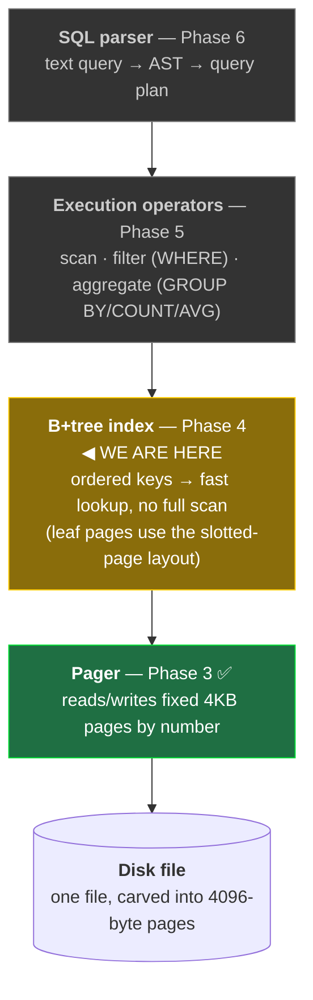
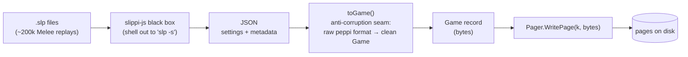
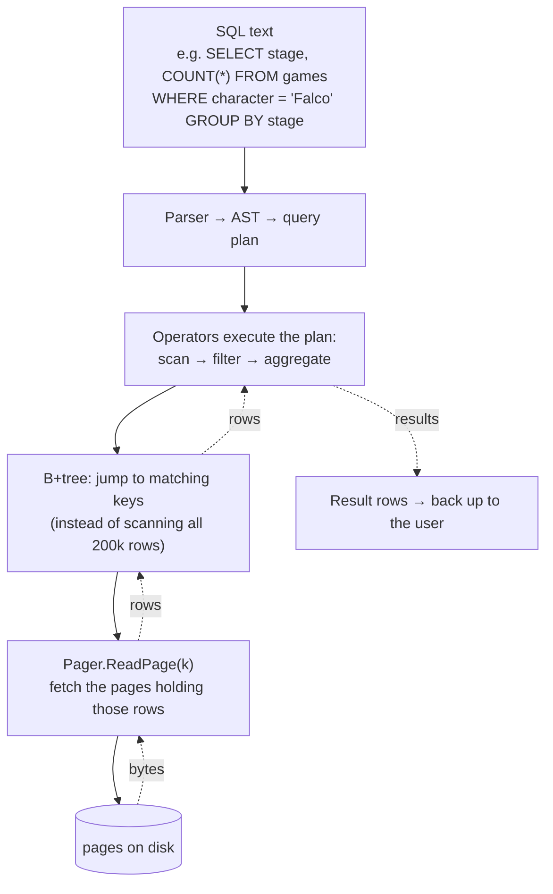
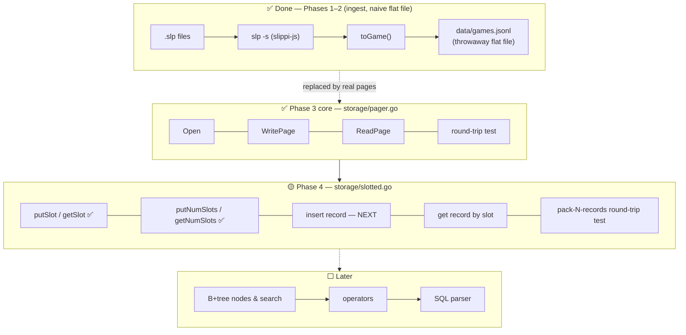
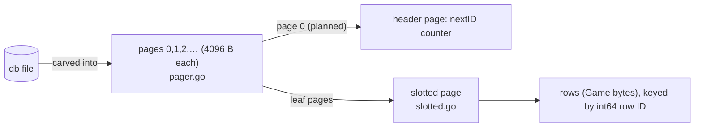

# rslp — Architecture

> Visual companion to `CONTEXT.md` (mission) and `PROGRESS.md` (roadmap & status).
> Diagrams use [Mermaid](https://mermaid.js.org/), which GitHub renders natively.
>
> **Four things are drawn here:**
> 1. **The engine stack** — the final layered design, built bottom-up.
> 2. **The two data paths** — how data flows *in* (ingest) and how a query flows *down* and back *up*.
> 3. **Where we are today** — the slice of the above that actually runs right now.
> 4. **Code map** — the medium level: which file does what, and how a page's bytes are laid out.

---

## 1. The engine stack (final design, built bottom-up)

A database is a stack of layers. Each layer only talks to the one directly below it, and
hides its complexity from the one above. We build **from the bottom up** — you can't have a
table until pages, a B+tree, and records exist beneath it.


```mermaid
flowchart TB
    SQL["<b>SQL parser</b> — Phase 6<br/>text query → AST → query plan"]
    OPS["<b>Execution operators</b> — Phase 5<br/>scan · filter (WHERE) · aggregate (GROUP BY/COUNT/AVG)"]
    TREE["<b>B+tree index</b> — Phase 4  ◀ WE ARE HERE<br/>ordered keys → fast lookup, no full scan<br/>(leaf pages use the slotted-page layout)"]
    PAGER["<b>Pager</b> — Phase 3 ✅<br/>reads/writes fixed 4KB pages by number"]
    DISK[("<b>Disk file</b><br/>one file, carved into 4096-byte pages")]

    SQL --> OPS --> TREE --> PAGER --> DISK

    classDef done fill:#1f6f43,stroke:#0d3,color:#fff
    classDef now fill:#8a6d0b,stroke:#fc0,color:#fff
    classDef todo fill:#333,stroke:#777,color:#ccc
    class PAGER done
    class TREE now
    class OPS,SQL todo
```

**Why bottom-up:** the pager knows nothing about games or tables — it just moves bytes in
fixed blocks. The B+tree sits on top and decides how records are laid out *inside* those
bytes. Operators sit on the B+tree. SQL sits on the operators. Each layer is a **deep
module**: a tiny interface (the pager is just `Open` / `ReadPage` / `WritePage`) hiding
significant complexity. Swap-ability comes from this — e.g. the B+tree will depend on a
pager *interface*, so a fake in-memory pager can stand in during tests.

---

## 2. The two data paths

### 2a. Ingest path — getting `.slp` replays onto disk (the "write" story)


```mermaid
flowchart LR
    SLP[".slp files<br/>(~200k Melee replays)"]
    JS["slippi-js black box<br/>(shell out to 'slp -s')"]
    JSON["JSON<br/>settings + metadata"]
    TOGAME["toGame()<br/>anti-corruption seam:<br/>raw peppi format → clean Game"]
    REC["Game record<br/>(bytes)"]
    PAGER["Pager.WritePage(k, bytes)"]
    DISK[("pages on disk")]

    SLP --> JS --> JSON --> TOGAME --> REC --> PAGER --> DISK
```

`.slp` parsing is a deliberate **black box** — no good Go parser exists, so we shell out to
`@slippi/slippi-js` and consume its JSON. `toGame()` is the seam that translates *their*
data model into *ours*. Everything left of the pager is Phases 1–2 (done); the pager is
Phase 3.

### 2b. Query path — answering a question (the "read" story)


```mermaid
flowchart TB
    Q["SQL text<br/>e.g. SELECT stage, COUNT(*) FROM games<br/>WHERE character = 'Falco' GROUP BY stage"]
    PARSE["Parser → AST → query plan"]
    OPS["Operators execute the plan:<br/>scan → filter → aggregate"]
    TREE["B+tree: jump to matching keys<br/>(instead of scanning all 200k rows)"]
    PAGER["Pager.ReadPage(k)<br/>fetch the pages holding those rows"]
    DISK[("pages on disk")]
    RESULT["Result rows → back up to the user"]

    Q --> PARSE --> OPS --> TREE --> PAGER --> DISK
    DISK -. bytes .-> PAGER -. rows .-> TREE -. rows .-> OPS -. results .-> RESULT
```

A query flows **down** the stack (SQL → plan → operators → index → pager → disk) and the
data flows **back up** (bytes → rows → filtered/aggregated results). The whole reason for
the B+tree (Phase 4) is to avoid the full O(n) scan we deliberately suffered in Phase 2.

---

## 3. Where we are today

Phases 1–2 run end-to-end (into a throwaway flat file). The pager's core is done. We're now
building the **slotted page** — the byte layout a B+tree leaf will use to hold variable-length rows.


```mermaid
flowchart TB
    subgraph DONE["✅ Done — Phases 1–2 (ingest, naive flat file)"]
        SLP[".slp files"] --> JS["slp -s (slippi-js)"] --> TOGAME["toGame()"] --> JSONL["data/games.jsonl<br/>(throwaway flat file)"]
    end

    subgraph P3["✅ Phase 3 core — storage/pager.go"]
        OPEN["Open"] --- WRITE["WritePage"] --- READ["ReadPage"] --- TEST["round-trip test"]
    end

    subgraph NOW["🟡 Phase 4 — storage/slotted.go"]
        SLOT["putSlot / getSlot ✅"]
        HDR["putNumSlots / getNumSlots ✅"]
        INS["insert record — NEXT"]
        GET["get record by slot"]
        RT["pack-N-records round-trip test"]
        SLOT --- HDR --- INS --- GET --- RT
    end

    subgraph LATER["⬜ Later"]
        TREE["B+tree nodes & search"] --> OPSX["operators"] --> SQLX["SQL parser"]
    end

    DONE -.->|"replaced by real pages"| P3
    P3 --> NOW -.-> LATER
```

> Deferred from Phase 3: the buffer-pool cache. The Phase 2 flat file stays in the diagram
> because the migration is part of the learning story.

---

## 4. Code map (medium level)

| File | Package | What it does |
|---|---|---|
| `main.go` | `main` | Ingest + naive query. Lists the replay folder → shells out to `slp -s` per file → `json.Unmarshal` into `raw*` structs → `toGame()` → writes `data/games.jsonl` → reads it back and counts Falco games (the Phase 2 O(n) scan). |
| `main.go` → `raw*` structs | | Mirror slippi-js's JSON exactly (`rawReplay`, `rawStart`, `rawPlayer`, `rawMetadata`). *Their* data model. |
| `main.go` → `Game` / `Player` | | *Our* clean domain model: names, not ids. |
| `main.go` → `toGame()` | | The anti-corruption seam: raw → clean, via the `stageNames` / `characterNames` lookup maps. |
| `storage/pager.go` | `storage` | The dumb byte-mover. `Pager{file}` + `Open(path)`, `WritePage(k, data)`, `ReadPage(k)`. Page k lives at byte `k × 4096`. Knows nothing about what's inside a page. |
| `storage/pager_test.go` | `storage` | Writes page 3, reads it back, asserts the bytes match. |
| `storage/slotted.go` | `storage` | Layout *inside* one page: the page header and the slot directory, packed with `encoding/binary`. Will become the B+tree leaf format. |
| `scratch.go` | `main` | Fully commented-out syntax practice. Not part of the build. |
| `docs/adr/` | | Architecture Decision Records (0001: synthetic `int64` row ID). |

### How the storage pieces nest


```mermaid
flowchart LR
    FILE[("db file")] -->|"carved into"| PAGES["pages 0,1,2,… (4096 B each)<br/>pager.go"]
    PAGES -->|"page 0 (planned)"| HDRPG["header page: nextID counter"]
    PAGES -->|"leaf pages"| SLOTTED["slotted page<br/>slotted.go"]
    SLOTTED --> ROWS["rows (Game bytes), keyed by int64 row ID"]
```

### Inside one slotted page (4096 bytes)

```
byte 0                                                            byte 4095
┌──────────┬──────────┬──────────┬─────────────────┬────────┬────────┐
│ numSlots │ record 0 │ record 1 │   free space    │ slot 1 │ slot 0 │
│ uint16   │ records grow  →     │                 │  ← slots grow   │
└──────────┴──────────┴──────────┴─────────────────┴────────┴────────┘
each slot = {Offset uint16, Length uint16} = 4 bytes
```

- **Header** — just `numSlots`, 2 bytes at byte 0.
- **Slot directory** starts at `PageSize − numSlots × 4`. It's calculated, never stored, so it can't drift out of sync.
- **Slot n** tells you where record n's bytes are (`Offset`) and how long they are (`Length`).
- No tombstones: rslp is an archive, so rows never get deleted.
